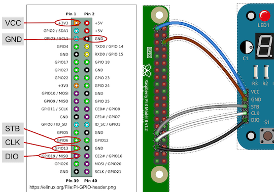

= Raspberry PiとTM1638ボードで動かす BridgePointのGPS Watch

このリポジトリにあるのは、 BridgePoint にサンプルとして付属している GPS_Watch プロジェクトをアレンジしたものです。

詳細な実験手順は、『Raspberry Pi もっと食べたいレシピ集（Raspberry Pi もくもく会レシピ集シリーズ Vol. 2）』の 第8章「UMLを使って Raspberry Pi アプリを作る」で説明しています。

Raspberry Pi もくもく会レシピ集シリーズのサイト:: https://raspimoku.gitlab.io/

== 必要なもの

* Raspberry Pi 本体
** ここでは、Raspberry Pi 3 Model B+を使用
* TM1638ボード（または同等品）
** 「TM1638 8ビット LEDデジタルチューブ 電子モジュール」といった商品名で販売している。
** ネットで1枚数百円から1000円位で購入可能。
* BridePoint
*** オープンソースのxtUMLモデリングツール。
** GPS Watchのサンプルを作るのに必要。
** また、モデルを編集してコードを再生成したい場合に必要。
* JavaをインストールしたPC
** 動作させたGPS Watchを、PC上で動いているGUIと連携させるために必要。

== 利用方法

=== Raspberry PiとTM1638ボードの接続

入手した TM1638ボード を、Raspberry Pi  に接続します。

Raspberry Pi  と TM1638ボード の接続ポートの対応は <<connection_raspi_tm1638_03>> のようになります。

[[connection_raspi_tm1638_03]]
.接続ポートの対応表
[%autowidth, cols=">1,<1",options="header"]
|===
| Raspberry Pi      | TM1638ボード
| +3.3V（1）  | VCC
| GND（6）    | GND
| GPIO6（31） | STB
| GPIO13（33）| CLK
| GPIO19（35）| DIO

|===

Raspberry Pi  と TM1638ボード の接続の詳細図を <<connection_raspi_tm1638_02>> に示します。

[[connection_raspi_tm1638_02]]
.Raspberry Pi  と TM1638ボード の接続（詳細）

接続が済んだら、もう一度確認しておきましょう。

=== TM1638ボード用ライブラリのインストール

TM1638ボード を使うアプリケーションを作るには、 TM1638ボード 用のライブラリが必要です。

下記Webサイトから BCM2835用のライブラリを入手して、インストールしましょう。付属のドキュメント通りにインストールします。

C library for Broadcom BCM 2835 as used in Raspberry Pi:: {raspi} のGPIO を使うときに必要となるライブラリです。 +
http://www.airspayce.com/mikem/bcm2835/

下記Webサイトから {tm1638board} 用のライブラリを入手して、インストールしましょう。こちらも、付属のドキュメント通りにインストールします。

TM1638 library for the Raspberry Pi:: {tm1638board} 用のライブラリです。 +
https://github.com/mjoldfield/pi-tm1638

=== GPS WatchプログラムをRaspberry Pi上でビルドする

BridgePoint 上で GPS Watch のサンプルは用意できているものとします。

このリポジトリのコードは、生成したコードに、 Raspberry Pi と tm1638 ボードを使って動かす部分を追加したものです。
`src` 以下のソースコードを、 Raspberry Pi に転送してくだい。

`makefile` は提供されているので、あとはビルドするだけです。

.{raspi} 向けに調整したGPS Watchをビルドする
[source,console]
----
pi@raspi-01:~/Documents/GPS_Watch/Debug $ make all
（略）
Finished building target: GPS_Watch
----

=== Raspberry PiでGPS Watch の動作を確認する

ビルドできたら、動かしてみましょう。

.{raspi} で動く GPS Watch の起動手順
. PC側でGUI画面を実行しておきます（この手順はもとのGPS Watchと同じです）。
. {raspi} のターミナルから、`GPS_Watch` を起動します。
. PC上のGUI画面や {tm1638board} 上の `START/STOP` ボタンを操作すると、時間を測り始めます。
. GUI画面のボタンと {tm1638board} 上のボタンのどちらを操作しても、表示が変化します。
. ターミナルで `Ctrl-C` を入力して、動作を停止します。

GUI画面と tm1638 ボードの両方から操作できることが確認できるでしょう。

=== 動作している様子

このシステムが動作する様子は YouTube にアップしてあります。

BridgePointのサンプルのGPS Watchを動かしてみた:: BeridgePointのサンプルの GPS Watch を動かした動画。 +
https://youtu.be/IaVM7KjwQ9w
BridgePointで生成したコードをtm1638ボードをつないだRaspberry Piで動かしてみた::  GPS Watch が Raspberry Pi  と TM1638ボード の組み合わせ動作している様子。 +
https://youtu.be/kNXow7kltDM

== 謝辞

なお、この章で紹介したシステムは、文部科学省が平成29年度に提示した「成長分野を支える情報技術人材の育成拠点の形成（enPiT-Pro）」に早稲田大学が代表校として申請し採択された「スマートエスイー : スマートシステム＆サービス技術の産学連携イノベーティブ人材育成」^<<SMART-SE>>^ の講義「モデル駆動開発」の演習で用いたものです。関係者各位に謝意を表します。

これまで BeridgePoint の開発、販売、コミュニティ支えてきた全てのみなさんに感謝します。とりわけ、 Levi Starrett氏には、スマートエスイーで Raspberry Pi  を使うにあたって、 xtUML Days 2018 ^<<XTUML2018>>^ での発表資料 ^<<LAVI-PDF>>^ , ^<<LAVI-V>>^ を利用することに快諾いただきました。一層の謝意を表します。

== 関連資料

- [[[XTUML]]] Executable UML. Wikipedia. +
https://en.wikipedia.org/wiki/Executable_UML.
- [[[XTUMLORG]]] xtUML.org -- eXecutable Translatable UML with BridgePoint. https://xtuml.org/.
- [[[BPINST]]] 久保秋. BridgePointのインストール手順. Qiita. http://bit.ly/31oBDl2.
- [[[ONEFACT]]] One Fact Inc. http://onefact.net/.
- [[[XTUML2018]]] xtUML Days 2018 is co-located with MODELS. +
https://xtuml.org/xtuml-days-2018-copenhagen/
- [[[LAVI-PDF]]] Starrett, Levi. 1 Application 3 Dialects 5+ Architectures, Platform independence with BridgePoint. +
xtUML Days 2018. https://xtuml.org/wp-content/uploads/2018/10/1-3-5.pdf.
- [[[LAVI-V]]] Starrett, Levi. GPS Watch multi-platform demo.  +
https://www.youtube.com/watch?v=TLFNod4Qvnw.
